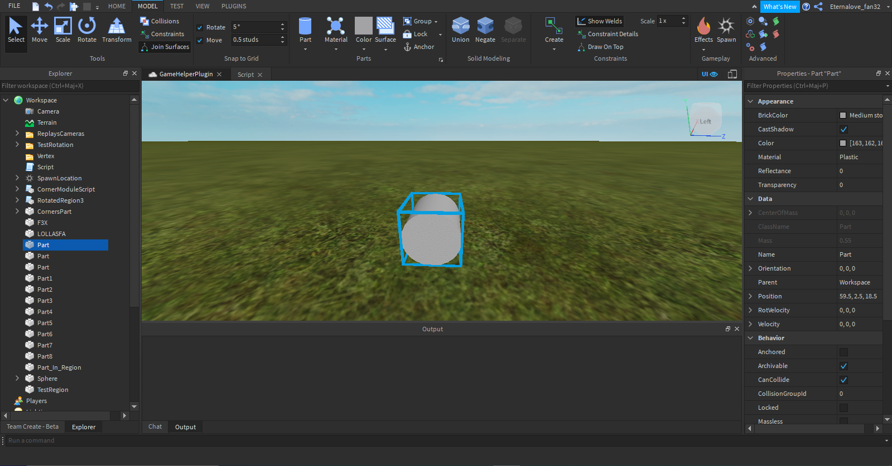
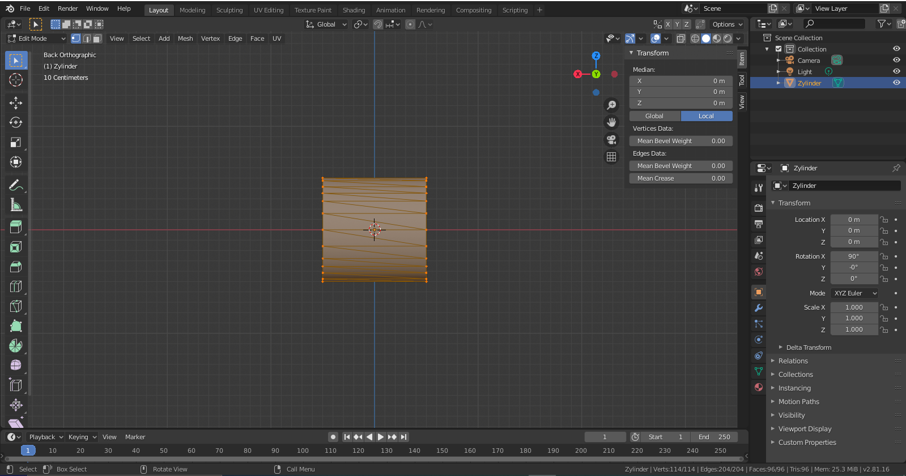
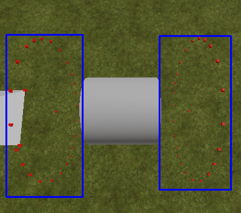
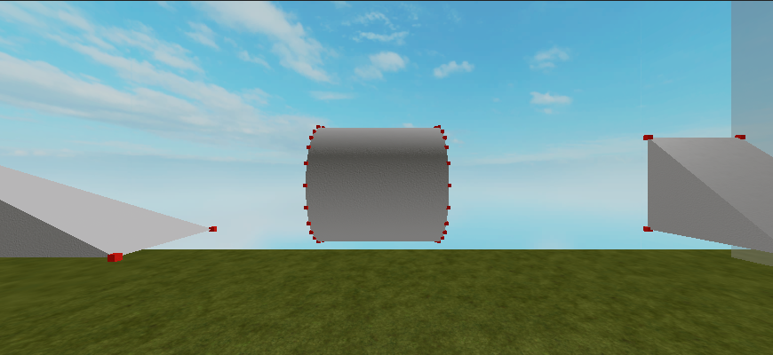
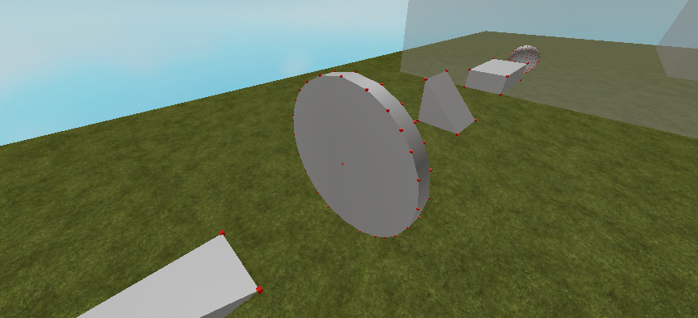
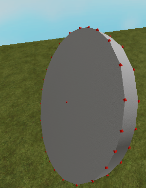

# Get the Corners of a Cylinder

Hi, welcome to this new tutorial section! In this part we will talk about vertices of a cylinder, how to get them and much more. 

The system is practically the same as for a ball (see other tutorial), you go to Blender (or other third party modeling program), take only the positive quadrant (vertices) and to get the other one I mirror the one I already have.

First you take a 2 x 2 x 2 cylinder (0.05 x 0.05 x 0.05 is the common, but not always, size I use for the vertices):



Then it is exported to Blender (position of course 0x0x0), which allows us to get the positions of the vertices:



As I said before, I take a quadrant, then I mirror the whole thing to get all my vertices (a Roblox cylinder has 114 vertices). This is what I got now (as a table):

```lua
local Vertices = {
	Vector3.new(0.5, 0, 0),
	Vector3.new(0.5, 0.5, 0),
	Vector3.new(0.5, 0.474342, 0.158114),
	Vector3.new(0.5, 0.416025, 0.27735),
	Vector3.new(0.5, 0.353553, 0.353553),
	Vector3.new(0.5, 0.27735, 0.416025),
	Vector3.new(0.5, 0.158114, 0.474342),
	Vector3.new(0.5, 0, 0.5),
}
```

Result:


Code:
```lua
--Table from above
local Parent = script.Parent
local Position = Parent.CFrame
local Size = Parent.Size

for index, vert in pairs(Vertices) do
	local Vertex = Instance.new("Part", workspace.Vertex)
	Vertex.BrickColor = BrickColor.Red()
	Vertex.Size = Vector3.new(0.01, 0.01, 0.01)
	Vertex.CanCollide = false
	Vertex.Anchored = true
	Vertex.Name = "Vertex"..index
	Vertex.Position = Position * vert
end
```
Now I'll skip the whole part with the mirroring, show you the code anyway:
```lua
for _,vert in pairs(Vertices) do
    local Mirrored = -vert
    local MirroredX = Vector3.new(-vert.X, vert.Y, vert.Z)
    local MirroredY = Vector3.new(vert.X, -vert.Y, vert.Z)
    local MirroredZ = Vector3.new(vert.X, vert.Y, -vert.Z)
    if not table.find(Vertices, Mirrored) then --If it not find the already mirrored vertex, then insert it in the table
        table.insert(Vertices, #Vertices + 1, Mirrored)
		print(MirroredX)
    elseif not table.find(Vertices, MirroredX) then
        table.insert(Vertices, #Vertices + 1, MirroredX)

    elseif not table.find(Vertices, MirroredY) then
        table.insert(Vertices, #Vertices + 1, MirroredY)

    elseif not table.find(Vertices, MirroredZ) then
        table.insert(Vertices, #Vertices + 1, MirroredZ)
    end
end
```

That's the whole table now:
```lua
local Vertices = {
    Vector3.new(1, 1, 0),
    Vector3.new(1, 0, 0),
    Vector3.new(1, 0, 1),
    Vector3.new(1, 0.94868302345276, 0.3162280023098),
    Vector3.new(1, 0.8320500254631, 0.5547000169754),
    Vector3.new(1, 0.70710700750351, 0.70710700750351),
    Vector3.new(1, 0.5547000169754, 0.8320500254631),
    Vector3.new(1, 0.3162280023098, 0.94868302345276),
    Vector3.new(-1, -1, -0),
    Vector3.new(-1, -0, -0),
    Vector3.new(-1, -0.94868302345276, -0.3162280023098),
    Vector3.new(-1, -0.8320500254631, -0.5547000169754),
    Vector3.new(-1, -0.70710700750351, -0.70710700750351),
    Vector3.new(-1, -0.5547000169754, -0.8320500254631),
    Vector3.new(-1, -0.3162280023098, -0.94868302345276),
    Vector3.new(1, -1, -0),
    Vector3.new(1, -0.94868302345276, -0.3162280023098),
    Vector3.new(1, -0.8320500254631, -0.5547000169754),
    Vector3.new(1, -0.70710700750351, -0.70710700750351),
    Vector3.new(1, -0.5547000169754, -0.8320500254631),
    Vector3.new(1, -0.3162280023098, -0.94868302345276),
    Vector3.new(-1, 1, 0),
    Vector3.new(-1, 0.94868302345276, 0.3162280023098),
    Vector3.new(-1, 0.8320500254631, 0.5547000169754),
    Vector3.new(-1, 0.70710700750351, 0.70710700750351),
    Vector3.new(-1, 0.5547000169754, 0.8320500254631),
    Vector3.new(-1, 0.3162280023098, 0.94868302345276),
    Vector3.new(-1, -0.94868302345276, 0.3162280023098),
    Vector3.new(-1, -0.8320500254631, 0.5547000169754),
    Vector3.new(-1, -0.70710700750351, 0.70710700750351),
    Vector3.new(-1, -0.5547000169754, 0.8320500254631),
    Vector3.new(-1, -0.3162280023098, 0.94868302345276),
    Vector3.new(1, 0.94868302345276, -0.3162280023098),
    Vector3.new(1, 0.8320500254631, -0.5547000169754),
    Vector3.new(1, 0.70710700750351, -0.70710700750351),
    Vector3.new(1, 0.5547000169754, -0.8320500254631),
    Vector3.new(1, 0.3162280023098, -0.94868302345276),
    Vector3.new(-1, 0.94868302345276, -0.3162280023098),
    Vector3.new(-1, 0.8320500254631, -0.5547000169754),
    Vector3.new(-1, 0.70710700750351, -0.70710700750351),
    Vector3.new(-1, 0.5547000169754, -0.8320500254631),
    Vector3.new(-1, 0.3162280023098, -0.94868302345276),
    Vector3.new(1, -0.94868302345276, 0.3162280023098),
    Vector3.new(1, -0.8320500254631, 0.5547000169754),
    Vector3.new(1, -0.70710700750351, 0.70710700750351),
    Vector3.new(1, -0.5547000169754, 0.8320500254631),
    Vector3.new(1, -0.3162280023098, 0.94868302345276),
    Vector3.new(-1, -0, -1),
    Vector3.new(1, -0, -1),
    Vector3.new(-1, 0, 1)
}
```

Nevertheless we have to adapt the position with the size, we have to remember that the position only works for a 2 x 2 x 2 cylinder, but this is not always the case:
```lua
Vertex.Position = Position * (vert * Size)
```

But then another problem arises:
 
Picture

It looks strange, for the simple reason that Roblox always uses the smallest **number** between the "Size.Z and Size.Y" for the radius of our cylinder, so it keeps a costant ratio of 1 (If Z is size 5, and Y is size 3, then the Z size automatically becomes the smallest size, so 3, so the ratio between both sizes is 1, so when you make Y size / Z size it automatically becomes 1). This forces us to use a new system (but if Roblox hadn't done it, our code would still work). But now, if I had to explain all the methods it would take too long, so I just commented my code so you understand it better, have fun reading it :-)

```lua
local Parent = script.Parent
local Position = Parent.Position
local Size = Parent.Size

local Vertices = {} --Use the previous table

local function getYZScalar()
	local radius = math.min(Size.Y, Size.Z)/2 --We are getting the smalltest number (as Roblox uses the smalltest number for calculate the radius of us cylinder) then divide the diameter (number = diameter) to get the radius
	return radius
end

local function getXScalar(vert)
	return Size.X*math.sign(vert.X)/2 --To position the vertices on the X axis, it's just the X size of the cylinder. Then use math.sign if the vertex was positive or negative (see on the devhub for more info) and divide it by 2
end

for index, vert in pairs(Vertices) do
	--Creating the parts to visualize us vertices
	local Vertex = Instance.new("Part", workspace.Vertex)
	Vertex.BrickColor = BrickColor.Red()
	Vertex.Size = Vector3.new(0.01, 0.01, 0.01)
	Vertex.CanCollide = false
	Vertex.Anchored = true
	Vertex.Name = "Vertex"..index
	--Getting the scalar for the positioning the vertices along the Y, Z and X axis
	local Scalar = getYZScalar()
	--Calculate the single parts of the final Position
	local X = getXScalar(vert)
	local Y = vert.Y*Scalar
	local Z = vert.Z*Scalar
	--And just normal position it (bad englisch, srry ik)
	Vertex.Position = (Position + Vector3.new(X,Y,Z))
end
```

So, I hope you enjoyed it. So in the end:








Full Script:

```lua
local Parent = script.Parent
local Position = Parent.CFrame
local Size = Parent.Size
local Radius = Parent.Size/2
local Vertices = {
	Vector3.new(0.5, -0.000107, -0.000009),
	Vector3.new(0.474, -0.000107, 0.15811),
	Vector3.new(0.416, -0.000107, 0.27734),
	Vector3.new(0.354, -0.000107, 0.35355),
	Vector3.new(0.474, 0.15799, -0.000009),
	Vector3.new(0.452, 0.15069, 0.15075),
	Vector3.new(0.40099, 0.13349, 0.26726),
	Vector3.new(0.34399, 0.11459, 0.34412),
	Vector3.new(0.416, 0.27729, -0.000009),
	Vector3.new(0.40099, 0.26719, 0.13362),
	Vector3.new(0.364, 0.24239, 0.24253),
	Vector3.new(0.32, 0.21309, 0.3198),
	Vector3.new(0.354, 0.35349, -0.000009),
	Vector3.new(0.34399, 0.34399, 0.1147),
	Vector3.new(0.32, 0.31969, 0.21319),
	Vector3.new(0.28899, 0.28859, 0.28867),
	Vector3.new(0.277, 0.41589, -0.000009),
	Vector3.new(0.267, 0.40079, 0.13362),
	Vector3.new(0.243, 0.36369, 0.24253),
	Vector3.new(0.158, 0.47419, -0.000009),
	Vector3.new(0.15099, 0.45219, 0.15075),
	Vector3.new(0, 0.49989, -0.000009),
	Vector3.new(0.277, -0.000107, 0.41602),
	Vector3.new(0.158, -0.000107, 0.47434),
	Vector3.new(0, -0.000107, 0.49999),
	Vector3.new(0.267, 0.40089, 0.000009),
	Vector3.new(0.15099, 0.15069, 0.45226),
	Vector3.new(0, 0.15799, 0.47434),
	Vector3.new(0.243, 0.24239, 0.3638),
	Vector3.new(0.134, 0.267219, 0.40089),
	Vector3.new(0, 0.27729, 0.41602),
	Vector3.new(0.213, 0.31969, 0.3198),
	Vector3.new(0.115, 0.34399, 0.34412),
	Vector3.new(0, 0.35349, 0.35355),
	Vector3.new(0.134, 0.40079, 0.26726),
	Vector3.new(0, 0.41589, 0.27734),
	Vector3.new(0, 0.47419, 0.15811),
	Vector3.new(0.267, 0.40089, 0.13349),
	Vector3.new(0.267, 0.13349, 0.40089),
	
	

	Vector3.new(-0.5, 0.000107, 9.00000032e-06),
	Vector3.new(-0.474000007, 0.000107, -0.158109993),
	Vector3.new(-0.416000009, 0.000107, -0.277339995),
	Vector3.new(-0.354000002, 0.000107, -0.353549987),
	Vector3.new(-0.474000007, -0.157989994, 9.00000032e-06),
	Vector3.new(-0.451999992, -0.150690004, -0.150749996),
	Vector3.new(-0.400990009, -0.133489996, -0.267259985),
	Vector3.new(-0.343989998, -0.114589997, -0.344119996),
	Vector3.new(-0.416000009, -0.277289987, 9.00000032e-06),
	Vector3.new(-0.400990009, -0.267190009, -0.133619994),
	Vector3.new(-0.363999993, -0.242390007, -0.242530003),
	Vector3.new(-0.319999993, -0.213090003, -0.319799989),
	Vector3.new(-0.354000002, -0.353489995, 9.00000032e-06),
	Vector3.new(-0.343989998, -0.343989998, -0.114699997),
	Vector3.new(-0.319999993, -0.319689989, -0.213190004),
	Vector3.new(-0.288989991, -0.288590014, -0.288670003),
	Vector3.new(-0.27700001, -0.415890008, 9.00000032e-06),
	Vector3.new(-0.26699999, -0.400790006, -0.133619994),
	Vector3.new(-0.243000001, -0.363689989, -0.242530003),
	Vector3.new(-0.158000007, -0.474189997, 9.00000032e-06),
	Vector3.new(-0.150989994, -0.452190012, -0.150749996),
	Vector3.new(-0, -0.49989, 9.00000032e-06),
	Vector3.new(-0.27700001, 0.000107, -0.416020006),
	Vector3.new(-0.158000007, 0.000107, -0.474339992),
	Vector3.new(-0, 0.000107, -0.499989986),
	Vector3.new(-0.26699999, -0.400889993, -9.00000032e-06),
	Vector3.new(-0.150989994, -0.150690004, -0.452259988),
	Vector3.new(-0, -0.157989994, -0.474339992),
	Vector3.new(-0.243000001, -0.242390007, -0.363799989),
	Vector3.new(-0.134000003, -0.267219007, -0.400889993),
	Vector3.new(-0, -0.277289987, -0.416020006),
	Vector3.new(-0.213, -0.319689989, -0.319799989),
	Vector3.new(-0.115000002, -0.343989998, -0.344119996),
	Vector3.new(-0, -0.353489995, -0.353549987),
	Vector3.new(-0.134000003, -0.400790006, -0.267259985),
	Vector3.new(-0, -0.415890008, -0.277339995),
	Vector3.new(-0, -0.474189997, -0.158109993),
	Vector3.new(-0.26699999, -0.400889993, -0.133489996),
    Vector3.new(-0.26699999, -0.133489996, -0.400889993),


    Vector3.new(-0.5, -0.00010699999984354, -9.0000003183377e-06),
    Vector3.new(-0.47400000691414, -0.00010699999984354, 0.15810999274254),
    Vector3.new(-0.41600000858307, -0.00010699999984354, 0.27733999490738),
    Vector3.new(-0.35400000214577, -0.00010699999984354, 0.35354998707771),
    Vector3.new(-0.47400000691414, 0.15798999369144, -9.0000003183377e-06),
    Vector3.new(-0.45199999213219, 0.15069000422955, 0.15074999630451),
    Vector3.new(-0.40099000930786, 0.13348999619484, 0.26725998520851),
    Vector3.new(-0.34398999810219, 0.11458999663591, 0.34411999583244),
    Vector3.new(-0.41600000858307, 0.27728998661041, -9.0000003183377e-06),
    Vector3.new(-0.40099000930786, 0.26719000935555, 0.13361999392509),
    Vector3.new(-0.36399999260902, 0.24239000678062, 0.24253000319004),
    Vector3.new(-0.31999999284744, 0.21309000253677, 0.3197999894619),
    Vector3.new(-0.35400000214577, 0.35348999500275, -9.0000003183377e-06),
    Vector3.new(-0.34398999810219, 0.34398999810219, 0.11469999700785),
    Vector3.new(-0.31999999284744, 0.31968998908997, 0.21319000422955),
    Vector3.new(-0.28898999094963, 0.28859001398087, 0.28867000341415),
    Vector3.new(-0.27700001001358, 0.41589000821114, -9.0000003183377e-06),
    Vector3.new(-0.266999989748, 0.40079000592232, 0.13361999392509),
    Vector3.new(-0.24300000071526, 0.36368998885155, 0.24253000319004),
    Vector3.new(-0.15800000727177, 0.47418999671936, -9.0000003183377e-06),
    Vector3.new(-0.1509899944067, 0.45219001173973, 0.15074999630451),
    Vector3.new(0, -0.49988999962807, -9.0000003183377e-06),
    Vector3.new(-0.27700001001358, -0.00010699999984354, 0.41602000594139),
    Vector3.new(-0.15800000727177, -0.00010699999984354, 0.47433999180794),
    Vector3.new(0, 0.00010699999984354, 0.49998998641968),
    Vector3.new(-0.266999989748, 0.40088999271393, 9.0000003183377e-06),
    Vector3.new(-0.1509899944067, 0.15069000422955, 0.4522599875927),
    Vector3.new(0, -0.15798999369144, 0.47433999180794),
    Vector3.new(-0.24300000071526, 0.24239000678062, 0.36379998922348),
    Vector3.new(-0.13400000333786, 0.26721900701523, 0.40088999271393),
    Vector3.new(0, -0.27728998661041, 0.41602000594139),
    Vector3.new(-0.21299999952316, 0.31968998908997, 0.3197999894619),
    Vector3.new(-0.11500000208616, 0.34398999810219, 0.34411999583244),
    Vector3.new(0, -0.35348999500275, 0.35354998707771),
    Vector3.new(-0.13400000333786, 0.40079000592232, 0.26725998520851),
    Vector3.new(0, -0.41589000821114, 0.27733999490738),
    Vector3.new(0, -0.47418999671936, 0.15810999274254),
    Vector3.new(-0.266999989748, 0.40088999271393, 0.13348999619484),
    Vector3.new(-0.266999989748, 0.13348999619484, 0.40088999271393),
    Vector3.new(0.5, 0.00010699999984354, 9.0000003183377e-06),
    Vector3.new(0.47400000691414, 0.00010699999984354, -0.15810999274254),
    Vector3.new(0.41600000858307, 0.00010699999984354, -0.27733999490738),
    Vector3.new(0.35400000214577, 0.00010699999984354, -0.35354998707771),
    Vector3.new(0.47400000691414, -0.15798999369144, 9.0000003183377e-06),
    Vector3.new(0.45199999213219, -0.15069000422955, -0.15074999630451),
    Vector3.new(0.40099000930786, -0.13348999619484, -0.26725998520851),
    Vector3.new(0.34398999810219, -0.11458999663591, -0.34411999583244),
    Vector3.new(0.41600000858307, -0.27728998661041, 9.0000003183377e-06),
    Vector3.new(0.40099000930786, -0.26719000935555, -0.13361999392509),
    Vector3.new(0.36399999260902, -0.24239000678062, -0.24253000319004),
    Vector3.new(0.31999999284744, -0.21309000253677, -0.3197999894619),
    Vector3.new(0.35400000214577, -0.35348999500275, 9.0000003183377e-06),
    Vector3.new(0.34398999810219, -0.34398999810219, -0.11469999700785),
    Vector3.new(0.31999999284744, -0.31968998908997, -0.21319000422955),
    Vector3.new(0.28898999094963, -0.28859001398087, -0.28867000341415),
    Vector3.new(0.27700001001358, -0.41589000821114, 9.0000003183377e-06),
    Vector3.new(0.266999989748, -0.40079000592232, -0.13361999392509),
    Vector3.new(0.24300000071526, -0.36368998885155, -0.24253000319004),
    Vector3.new(0.15800000727177, -0.47418999671936, 9.0000003183377e-06),
    Vector3.new(0.1509899944067, -0.45219001173973, -0.15074999630451),
    Vector3.new(0, 0.49988999962807, 9.0000003183377e-06),
    Vector3.new(0.27700001001358, 0.00010699999984354, -0.41602000594139),
    Vector3.new(0.15800000727177, 0.00010699999984354, -0.47433999180794),
    Vector3.new(0, -0.00010699999984354, -0.49998998641968),
    Vector3.new(0.266999989748, -0.40088999271393, -9.0000003183377e-06),
    Vector3.new(0.1509899944067, -0.15069000422955, -0.4522599875927),
    Vector3.new(0, 0.15798999369144, -0.47433999180794),
    Vector3.new(0.24300000071526, -0.24239000678062, -0.36379998922348),
    Vector3.new(0.13400000333786, -0.26721900701523, -0.40088999271393),
    Vector3.new(0, 0.27728998661041, -0.41602000594139),
    Vector3.new(0.21299999952316, -0.31968998908997, -0.3197999894619),
    Vector3.new(0.11500000208616, -0.34398999810219, -0.34411999583244),
    Vector3.new(0, 0.35348999500275, -0.35354998707771),
    Vector3.new(0.13400000333786, -0.40079000592232, -0.26725998520851),
    Vector3.new(0, 0.41589000821114, -0.27733999490738),
    Vector3.new(0, 0.47418999671936, -0.15810999274254),
    Vector3.new(0.266999989748, -0.40088999271393, -0.13348999619484),
    Vector3.new(0.266999989748, -0.13348999619484, -0.40088999271393),


    Vector3.new(0.5, 0.00010699999984354, -9.0000003183377e-06),
    Vector3.new(0.47400000691414, 0.00010699999984354, 0.15810999274254),
    Vector3.new(0.41600000858307, 0.00010699999984354, 0.27733999490738),
    Vector3.new(0.35400000214577, 0.00010699999984354, 0.35354998707771),
    Vector3.new(0.47400000691414, -0.15798999369144, -9.0000003183377e-06),
    Vector3.new(0.45199999213219, -0.15069000422955, 0.15074999630451),
    Vector3.new(0.40099000930786, -0.13348999619484, 0.26725998520851),
    Vector3.new(0.34398999810219, -0.11458999663591, 0.34411999583244),
    Vector3.new(0.41600000858307, -0.27728998661041, -9.0000003183377e-06),
    Vector3.new(0.40099000930786, -0.26719000935555, 0.13361999392509),
    Vector3.new(0.36399999260902, -0.24239000678062, 0.24253000319004),
    Vector3.new(0.31999999284744, -0.21309000253677, 0.3197999894619),
    Vector3.new(0.35400000214577, -0.35348999500275, -9.0000003183377e-06),
    Vector3.new(0.34398999810219, -0.34398999810219, 0.11469999700785),
    Vector3.new(0.31999999284744, -0.31968998908997, 0.21319000422955),
    Vector3.new(0.28898999094963, -0.28859001398087, 0.28867000341415),
    Vector3.new(0.27700001001358, -0.41589000821114, -9.0000003183377e-06),
    Vector3.new(0.266999989748, -0.40079000592232, 0.13361999392509),
    Vector3.new(0.24300000071526, -0.36368998885155, 0.24253000319004),
    Vector3.new(0.15800000727177, -0.47418999671936, -9.0000003183377e-06),
    Vector3.new(0.1509899944067, -0.45219001173973, 0.15074999630451),
    Vector3.new(0.27700001001358, 0.00010699999984354, 0.41602000594139),
    Vector3.new(0.15800000727177, 0.00010699999984354, 0.47433999180794),
    Vector3.new(0.266999989748, -0.40088999271393, 9.0000003183377e-06),
    Vector3.new(0.1509899944067, -0.15069000422955, 0.4522599875927),
    Vector3.new(0.24300000071526, -0.24239000678062, 0.36379998922348),
    Vector3.new(0.13400000333786, -0.26721900701523, 0.40088999271393),
    Vector3.new(0.21299999952316, -0.31968998908997, 0.3197999894619),
    Vector3.new(0.11500000208616, -0.34398999810219, 0.34411999583244),
    Vector3.new(0.13400000333786, -0.40079000592232, 0.26725998520851),
    Vector3.new(0.266999989748, -0.40088999271393, 0.13348999619484),
    Vector3.new(0.266999989748, -0.13348999619484, 0.40088999271393),
    Vector3.new(-0.5, -0.00010699999984354, 9.0000003183377e-06),
    Vector3.new(-0.47400000691414, -0.00010699999984354, -0.15810999274254),
    Vector3.new(-0.41600000858307, -0.00010699999984354, -0.27733999490738),
    Vector3.new(-0.35400000214577, -0.00010699999984354, -0.35354998707771),
    Vector3.new(-0.47400000691414, 0.15798999369144, 9.0000003183377e-06),
    Vector3.new(-0.45199999213219, 0.15069000422955, -0.15074999630451),
    Vector3.new(-0.40099000930786, 0.13348999619484, -0.26725998520851),
    Vector3.new(-0.34398999810219, 0.11458999663591, -0.34411999583244),
    Vector3.new(-0.41600000858307, 0.27728998661041, 9.0000003183377e-06),
    Vector3.new(-0.40099000930786, 0.26719000935555, -0.13361999392509),
    Vector3.new(-0.36399999260902, 0.24239000678062, -0.24253000319004),
    Vector3.new(-0.31999999284744, 0.21309000253677, -0.3197999894619),
    Vector3.new(-0.35400000214577, 0.35348999500275, 9.0000003183377e-06),
    Vector3.new(-0.34398999810219, 0.34398999810219, -0.11469999700785),
    Vector3.new(-0.31999999284744, 0.31968998908997, -0.21319000422955),
    Vector3.new(-0.28898999094963, 0.28859001398087, -0.28867000341415),
    Vector3.new(-0.27700001001358, 0.41589000821114, 9.0000003183377e-06),
    Vector3.new(-0.266999989748, 0.40079000592232, -0.13361999392509),
    Vector3.new(-0.24300000071526, 0.36368998885155, -0.24253000319004),
    Vector3.new(-0.15800000727177, 0.47418999671936, 9.0000003183377e-06),
    Vector3.new(-0.1509899944067, 0.45219001173973, -0.15074999630451),
    Vector3.new(-0.27700001001358, -0.00010699999984354, -0.41602000594139),
    Vector3.new(-0.15800000727177, -0.00010699999984354, -0.47433999180794),
    Vector3.new(-0.266999989748, 0.40088999271393, -9.0000003183377e-06),
    Vector3.new(-0.1509899944067, 0.15069000422955, -0.4522599875927),
    Vector3.new(-0.24300000071526, 0.24239000678062, -0.36379998922348),
    Vector3.new(-0.13400000333786, 0.26721900701523, -0.40088999271393),
    Vector3.new(-0.21299999952316, 0.31968998908997, -0.3197999894619),
    Vector3.new(-0.11500000208616, 0.34398999810219, -0.34411999583244),
    Vector3.new(-0.13400000333786, 0.40079000592232, -0.26725998520851),
    Vector3.new(-0.266999989748, 0.40088999271393, -0.13348999619484),
    Vector3.new(-0.266999989748, 0.13348999619484, -0.40088999271393),
    Vector3.new(-0.5, 0.00010699999984354, -9.0000003183377e-06),
    Vector3.new(-0.47400000691414, 0.00010699999984354, 0.15810999274254),
    Vector3.new(-0.41600000858307, 0.00010699999984354, 0.27733999490738),
    Vector3.new(-0.35400000214577, 0.00010699999984354, 0.35354998707771),
    Vector3.new(-0.47400000691414, -0.15798999369144, -9.0000003183377e-06),
    Vector3.new(-0.45199999213219, -0.15069000422955, 0.15074999630451),
    Vector3.new(-0.40099000930786, -0.13348999619484, 0.26725998520851),
    Vector3.new(-0.34398999810219, -0.11458999663591, 0.34411999583244),
    Vector3.new(-0.41600000858307, -0.27728998661041, -9.0000003183377e-06),
    Vector3.new(-0.40099000930786, -0.26719000935555, 0.13361999392509),
    Vector3.new(-0.36399999260902, -0.24239000678062, 0.24253000319004),
    Vector3.new(-0.31999999284744, -0.21309000253677, 0.3197999894619),
    Vector3.new(-0.35400000214577, -0.35348999500275, -9.0000003183377e-06),
    Vector3.new(-0.34398999810219, -0.34398999810219, 0.11469999700785),
    Vector3.new(-0.31999999284744, -0.31968998908997, 0.21319000422955),
    Vector3.new(-0.28898999094963, -0.28859001398087, 0.28867000341415),
    Vector3.new(-0.27700001001358, -0.41589000821114, -9.0000003183377e-06),
    Vector3.new(-0.266999989748, -0.40079000592232, 0.13361999392509),
    Vector3.new(-0.24300000071526, -0.36368998885155, 0.24253000319004),
    Vector3.new(-0.15800000727177, -0.47418999671936, -9.0000003183377e-06),
    Vector3.new(-0.1509899944067, -0.45219001173973, 0.15074999630451),
    Vector3.new(-0.27700001001358, 0.00010699999984354, 0.41602000594139),
    Vector3.new(-0.15800000727177, 0.00010699999984354, 0.47433999180794),
    Vector3.new(-0.266999989748, -0.40088999271393, 9.0000003183377e-06),
    Vector3.new(-0.1509899944067, -0.15069000422955, 0.4522599875927),
    Vector3.new(-0.24300000071526, -0.24239000678062, 0.36379998922348),
    Vector3.new(-0.13400000333786, -0.26721900701523, 0.40088999271393),
    Vector3.new(-0.21299999952316, -0.31968998908997, 0.3197999894619),
    Vector3.new(-0.11500000208616, -0.34398999810219, 0.34411999583244),
    Vector3.new(-0.13400000333786, -0.40079000592232, 0.26725998520851),
    Vector3.new(-0.266999989748, -0.40088999271393, 0.13348999619484),
    Vector3.new(-0.266999989748, -0.13348999619484, 0.40088999271393),
    Vector3.new(0.5, -0.00010699999984354, 9.0000003183377e-06),
    Vector3.new(0.47400000691414, -0.00010699999984354, -0.15810999274254),
    Vector3.new(0.41600000858307, -0.00010699999984354, -0.27733999490738),
    Vector3.new(0.35400000214577, -0.00010699999984354, -0.35354998707771),
    Vector3.new(0.47400000691414, 0.15798999369144, 9.0000003183377e-06),
    Vector3.new(0.45199999213219, 0.15069000422955, -0.15074999630451),
    Vector3.new(0.40099000930786, 0.13348999619484, -0.26725998520851),
    Vector3.new(0.34398999810219, 0.11458999663591, -0.34411999583244),
    Vector3.new(0.41600000858307, 0.27728998661041, 9.0000003183377e-06),
    Vector3.new(0.40099000930786, 0.26719000935555, -0.13361999392509),
    Vector3.new(0.36399999260902, 0.24239000678062, -0.24253000319004),
    Vector3.new(0.31999999284744, 0.21309000253677, -0.3197999894619),
    Vector3.new(0.35400000214577, 0.35348999500275, 9.0000003183377e-06),
    Vector3.new(0.34398999810219, 0.34398999810219, -0.11469999700785),
    Vector3.new(0.31999999284744, 0.31968998908997, -0.21319000422955),
    Vector3.new(0.28898999094963, 0.28859001398087, -0.28867000341415),
    Vector3.new(0.27700001001358, 0.41589000821114, 9.0000003183377e-06),
    Vector3.new(0.266999989748, 0.40079000592232, -0.13361999392509),
    Vector3.new(0.24300000071526, 0.36368998885155, -0.24253000319004),
    Vector3.new(0.15800000727177, 0.47418999671936, 9.0000003183377e-06),
    Vector3.new(0.1509899944067, 0.45219001173973, -0.15074999630451),
    Vector3.new(0.27700001001358, -0.00010699999984354, -0.41602000594139),
    Vector3.new(0.15800000727177, -0.00010699999984354, -0.47433999180794),
    Vector3.new(0.266999989748, 0.40088999271393, -9.0000003183377e-06),
    Vector3.new(0.1509899944067, 0.15069000422955, -0.4522599875927),
    Vector3.new(0.24300000071526, 0.24239000678062, -0.36379998922348),
    Vector3.new(0.13400000333786, 0.26721900701523, -0.40088999271393),
    Vector3.new(0.21299999952316, 0.31968998908997, -0.3197999894619),
    Vector3.new(0.11500000208616, 0.34398999810219, -0.34411999583244),
    Vector3.new(0.13400000333786, 0.40079000592232, -0.26725998520851),
    Vector3.new(0.266999989748, 0.40088999271393, -0.13348999619484),
    Vector3.new(0.266999989748, 0.13348999619484, -0.40088999271393),
}
for index, vert in ipairs(Vertices) do
	local Vertex = Instance.new("Part")
	Vertex.Parent = workspace.SphereVertices
	Vertex.BrickColor = BrickColor.Red()
	Vertex.Size = Vector3.new(0.05, 0.05, 0.05)
	Vertex.CanCollide = false
	Vertex.Anchored = true
	Vertex.Name = "Vertex"..index
	Vertex.Position = Position * (vert * Size)
end
--[[This is new. I wrote this so that if you resize the Part or change its Position you just]]--
local function onPositionUpdate()
	local NewPosition = Parent.CFrame
	local Offset = Position:ToObjectSpace(NewPosition)
	for i,VertexPart in ipairs(workspace.SphereVertices:GetChildren()) do
		local vertex = VertexPart.CFrame
		VertexPart.Position = (vertex*Offset).Position
		Position = NewPosition
	end
end

local function onSizeUpdate()
	local NewSize = Parent.Size
	for i,VertexPart in ipairs(workspace.SphereVertices:GetChildren()) do
		local vertex = VertexPart.Position
		Size = NewSize
		VertexPart.Position = Position * (Vertices[i] * Size)
	end
end

Parent:GetPropertyChangedSignal("Position"):Connect(onPositionUpdate)
Parent:GetPropertyChangedSignal("Size"):Connect(onSizeUpdate)
```
And we're practically finished! You can now use the vertexes of your RobloxCylinder the way you want. Just fantastic, right? So, I hope you enjoyed it, and except for one next time!

## Edit
I now updated the code so the vertices are updated when you change the position or size of the parent, this currently **NOT** works for the rotation:
```lua
local Parent = script.Parent
local Position = Parent.CFrame
local Rotation = Parent.Orientation
local Size = Parent.Size
local X, Y, Z
local Vertices = {
    Vector3.new(1, 1, 0),
    Vector3.new(1, 0, 0),
    Vector3.new(1, 0, 1),
    Vector3.new(1, 0.94868302345276, 0.3162280023098),
    Vector3.new(1, 0.8320500254631, 0.5547000169754),
    Vector3.new(1, 0.70710700750351, 0.70710700750351),
    Vector3.new(1, 0.5547000169754, 0.8320500254631),
    Vector3.new(1, 0.3162280023098, 0.94868302345276),
    Vector3.new(-1, -1, -0),
    Vector3.new(-1, -0, -0),
    Vector3.new(-1, -0.94868302345276, -0.3162280023098),
    Vector3.new(-1, -0.8320500254631, -0.5547000169754),
    Vector3.new(-1, -0.70710700750351, -0.70710700750351),
    Vector3.new(-1, -0.5547000169754, -0.8320500254631),
    Vector3.new(-1, -0.3162280023098, -0.94868302345276),
    Vector3.new(1, -1, -0),
    Vector3.new(1, -0.94868302345276, -0.3162280023098),
    Vector3.new(1, -0.8320500254631, -0.5547000169754),
    Vector3.new(1, -0.70710700750351, -0.70710700750351),
    Vector3.new(1, -0.5547000169754, -0.8320500254631),
    Vector3.new(1, -0.3162280023098, -0.94868302345276),
    Vector3.new(-1, 1, 0),
    Vector3.new(-1, 0.94868302345276, 0.3162280023098),
    Vector3.new(-1, 0.8320500254631, 0.5547000169754),
    Vector3.new(-1, 0.70710700750351, 0.70710700750351),
    Vector3.new(-1, 0.5547000169754, 0.8320500254631),
    Vector3.new(-1, 0.3162280023098, 0.94868302345276),
    Vector3.new(-1, -0.94868302345276, 0.3162280023098),
    Vector3.new(-1, -0.8320500254631, 0.5547000169754),
    Vector3.new(-1, -0.70710700750351, 0.70710700750351),
    Vector3.new(-1, -0.5547000169754, 0.8320500254631),
    Vector3.new(-1, -0.3162280023098, 0.94868302345276),
    Vector3.new(1, 0.94868302345276, -0.3162280023098),
    Vector3.new(1, 0.8320500254631, -0.5547000169754),
    Vector3.new(1, 0.70710700750351, -0.70710700750351),
    Vector3.new(1, 0.5547000169754, -0.8320500254631),
    Vector3.new(1, 0.3162280023098, -0.94868302345276),
    Vector3.new(-1, 0.94868302345276, -0.3162280023098),
    Vector3.new(-1, 0.8320500254631, -0.5547000169754),
    Vector3.new(-1, 0.70710700750351, -0.70710700750351),
    Vector3.new(-1, 0.5547000169754, -0.8320500254631),
    Vector3.new(-1, 0.3162280023098, -0.94868302345276),
    Vector3.new(1, -0.94868302345276, 0.3162280023098),
    Vector3.new(1, -0.8320500254631, 0.5547000169754),
    Vector3.new(1, -0.70710700750351, 0.70710700750351),
    Vector3.new(1, -0.5547000169754, 0.8320500254631),
    Vector3.new(1, -0.3162280023098, 0.94868302345276),
    Vector3.new(-1, -0, -1),
    Vector3.new(1, -0, -1),
    Vector3.new(-1, 0, 1)
}

local function getYZScalar(SizeParam)
	local radius = math.min(SizeParam.Y, SizeParam.Z)/2 --We are getting the smalltest number (as Roblox uses the smalltest number for calculate the radius of us cylinder) then divide the diameter (number = diameter) to get the radius
	return radius
end

local function getXScalar(vert, SizeParam)
	return SizeParam.X*math.sign(vert.X)/2 --To position the vertices on the X axis, it's just the X size of the cylinder. Then use math.sign if the vertex was positive or negative (see on the devhub for more info) and divide it by 2
end

for index, vert in ipairs(Vertices) do
	--Creating the parts to visualize us vertices
	local Vertex = Instance.new("Part", workspace.CylinderVertices)
	Vertex.BrickColor = BrickColor.Red()
	Vertex.Size = Vector3.new(0.01, 0.01, 0.01)
	Vertex.CanCollide = false
	Vertex.Anchored = true
	Vertex.Name = "Vertex"..index
	--Getting the scalar for the positioning the vertices along the Y, Z and X axis
	local Scalar = getYZScalar(Size)
	--Calculate the single parts of the final Position
	X, Y, Z = getXScalar(vert, Size), vert.Y*Scalar, vert.Z*Scalar
	--And just normal position it (bad englisch, srry ik)
	Vertex.CFrame = (Position * CFrame.new(X, Y, Z))
end

local function onPositionUpdate()
	local NewPosition = Parent.CFrame
	local Offset = Position:ToObjectSpace(NewPosition).Position
		
	for i,VertexPart in ipairs(workspace.CylinderVertices:GetChildren()) do
		local vertex = VertexPart.CFrame
		VertexPart.CFrame = vertex*CFrame.new(Offset)
	end
	Position = NewPosition
end

local function onSizeUpdate()
	local NewSize = Parent.Size
	for i,VertexPart in ipairs(workspace.CylinderVertices:GetChildren()) do
		local vertex = Vertices[i]
		local Scalar = getYZScalar(NewSize)
		X, Y, Z = getXScalar(vertex, NewSize), vertex.Y*Scalar, vertex.Z*Scalar

		VertexPart.CFrame = (Position * CFrame.new(X,Y,Z))
	end
	Size = NewSize
end

Parent:GetPropertyChangedSignal("Position"):Connect(onPositionUpdate)
Parent:GetPropertyChangedSignal("Size"):Connect(onSizeUpdate)
```
