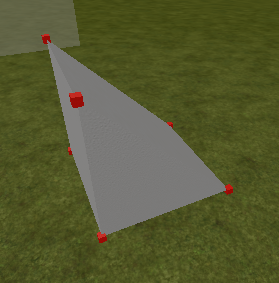
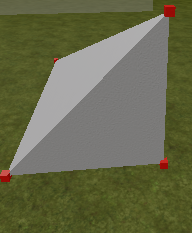

# GetCornersOfWedgeAndCornerWedge
Hi, welcome to this new tutorial section! In this part we will talk about vertices of a wedge and corner-wedge, how to get them and much more. 

I would first say to you: First think what are the difference between a part and a wedge part or a corner-wedge part.

Then, after this: Pls go see my tutorial on how to get the vertices of a normal Part, then this section here is not so hard to understand. To get the vertices of a wedge:
Just delete 2 vertices and you got it.



And for a corner-wedge part delete 3 vertices.



Srly, it just easy, but if you not understandet this:
If a part has 8 vertices and a wedge part 6 vertices, just find the vertices that the wedge part not own and delete these. Same thing with the corner-wedge part.

Code for the wedge part:
```lua
local CornerModuleScript = require(workspace.CornerModuleScript)
local Reference = workspace.TestRegion

local PartCFrame = script.Parent.CFrame
local Size = script.Parent.Size

local Table = {
	"TopUpperRightCorner",
	"BottomUpperRightCorner",
	"BottomUnderLeftCorner",
	"BottomUpperLeftCorner",
	"TopUpperLeftCorner",
	"BottomUnderRightCorner"
}

for _,vertex in ipairs(Table) do
	local Vert = Instance.new("Part")
	Vert.Parent = workspace.WedgeVertices
	Vert.Name = vertex
	Vert.CanCollide = false
	Vert.Anchored = true
	Vert.Size = Vector3.new(.1,.1,.1)
	Vert.BrickColor = BrickColor.Red()
end

local function onCFrameOrSizeUpdate()
	PartCFrame = script.Parent.CFrame
	Size = script.Parent.Size
	
	local TopUpperRightCorner = workspace.WedgeVertices.TopUpperRightCorner
	local BottomUpperRightCorner = workspace.WedgeVertices.BottomUpperRightCorner
	local BottomUnderLeftCorner = workspace.WedgeVertices.BottomUnderLeftCorner
	local BottomUpperLeftCorner = workspace.WedgeVertices.BottomUpperLeftCorner
	local TopUpperLeftCorner = workspace.WedgeVertices.TopUpperLeftCorner
	local BottomUnderRightCorner = workspace.WedgeVertices.BottomUnderRightCorner
	
	TopUpperRightCorner.CFrame = PartCFrame*CFrame.new(-Size.X/2, Size.Y/2, Size.Z/2)
	BottomUpperRightCorner.CFrame = PartCFrame*CFrame.new(-Size/2)
	BottomUnderLeftCorner.CFrame = PartCFrame*CFrame.new(Size.X/2 , -Size.Y/2 , Size.Z/2)
	BottomUpperLeftCorner.CFrame = PartCFrame*CFrame.new(Size.X/2 , -Size.Y/2 , -Size.Z/2)
	TopUpperLeftCorner.CFrame = PartCFrame*CFrame.new(Size/2)
	BottomUnderRightCorner.CFrame = PartCFrame*CFrame.new(-Size.X/2 , -Size.Y/2 , Size.Z/2)

end

onCFrameOrSizeUpdate()
script.Parent:GetPropertyChangedSignal("CFrame"):Connect(onCFrameOrSizeUpdate)
script.Parent:GetPropertyChangedSignal("Size"):Connect(onCFrameOrSizeUpdate)
```

And Script for the corner-wedge part:
```lua
local CornerModuleScript = require(workspace.CornerModuleScript)
local Reference = workspace.TestRegion

local PartCFrame = script.Parent.CFrame
local Size = script.Parent.Size

local Table = {
	"BottomUpperRightCorner",
	"BottomUnderLeftCorner",
	"BottomUpperLeftCorner",
	"TopUnderLeftCorner",
	"BottomUnderRightCorner"
}

for _,vertex in ipairs(Table) do
	local Vert = Instance.new("Part")
	Vert.Parent = workspace.CornerWedgeVertices
	Vert.Name = vertex
	Vert.CanCollide = false
	Vert.Anchored = true
	Vert.Size = Vector3.new(.1,.1,.1)
	Vert.BrickColor = BrickColor.Red()
end

local function onCFrameOrSizeUpdate()
	PartCFrame = script.Parent.CFrame
	Size = script.Parent.Size

	local BottomUpperRightCorner = workspace.CornerWedgeVertices.BottomUpperRightCorner
	local BottomUnderLeftCorner = workspace.CornerWedgeVertices.BottomUnderLeftCorner
	local BottomUpperLeftCorner = workspace.CornerWedgeVertices.BottomUpperLeftCorner
	local TopUnderLeftCorner = workspace.CornerWedgeVertices.TopUnderLeftCorner
	local BottomUnderRightCorner = workspace.CornerWedgeVertices.BottomUnderRightCorner
	
	BottomUpperRightCorner.CFrame = PartCFrame*CFrame.new(-Size/2)
	BottomUnderLeftCorner.CFrame = PartCFrame*CFrame.new(Size.X/2 , -Size.Y/2 , Size.Z/2)
	BottomUpperLeftCorner.CFrame = PartCFrame*CFrame.new(Size.X/2 , -Size.Y/2 , -Size.Z/2)
	TopUnderLeftCorner.CFrame = PartCFrame*CFrame.new(Size.X/2 , Size.Y/2 , -Size.Z/2)
	BottomUnderRightCorner.CFrame = PartCFrame*CFrame.new(-Size.X/2 , -Size.Y/2 , Size.Z/2)
	
end

onCFrameOrSizeUpdate()
script.Parent:GetPropertyChangedSignal("CFrame"):Connect(onCFrameOrSizeUpdate)
script.Parent:GetPropertyChangedSignal("Size"):Connect(onCFrameOrSizeUpdate)
```

And we're practically finished! You can now use the vertexes of your RobloxWedge and RobloxCornerWedge parts the way you want.
